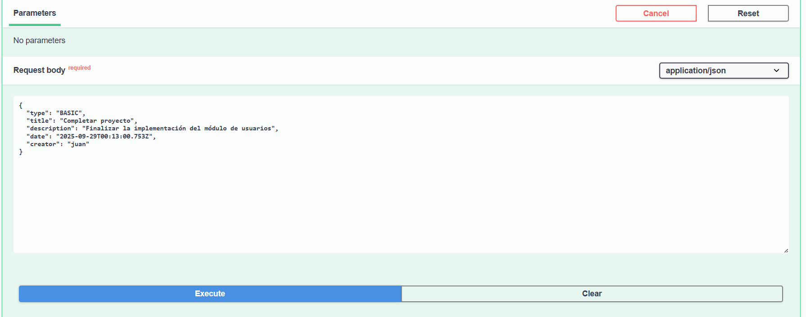
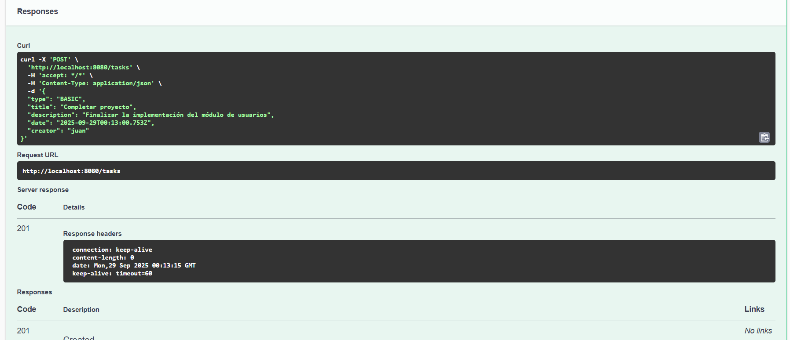
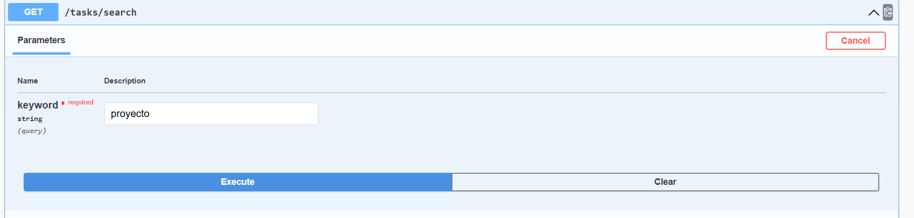
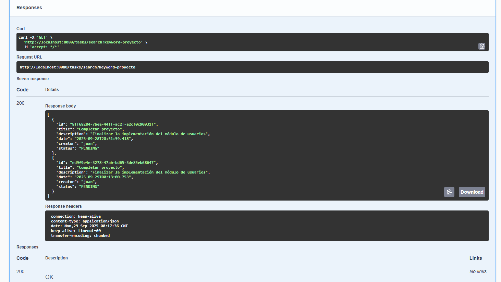
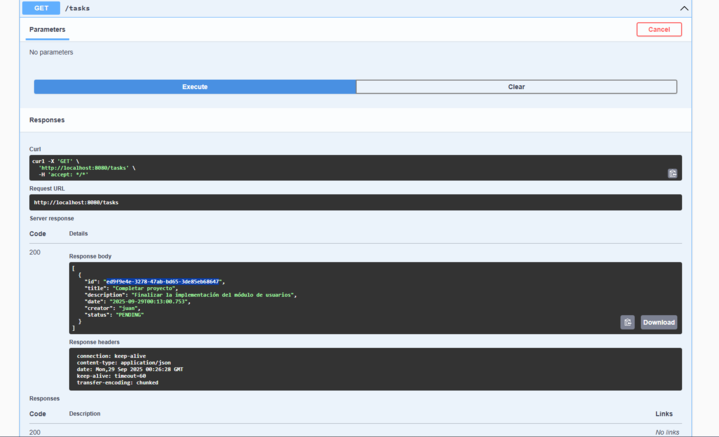
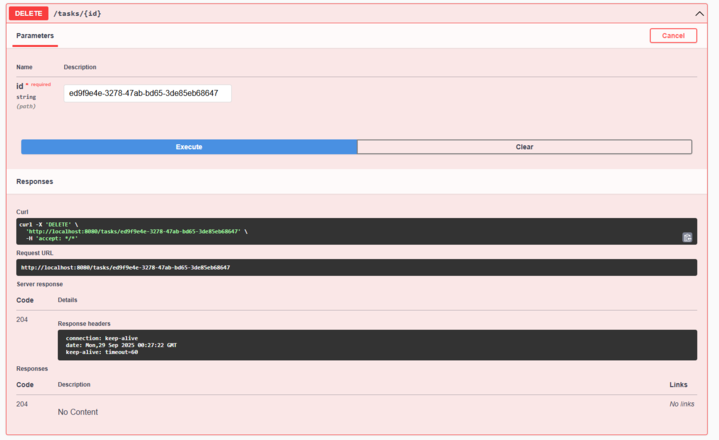
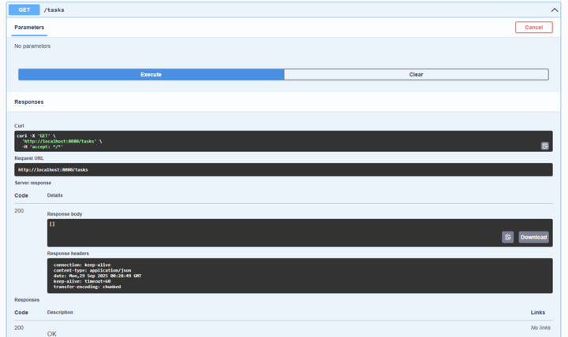
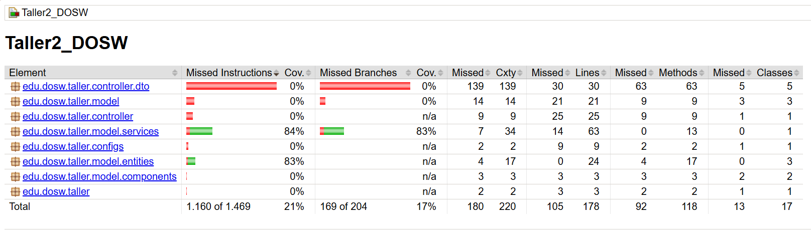
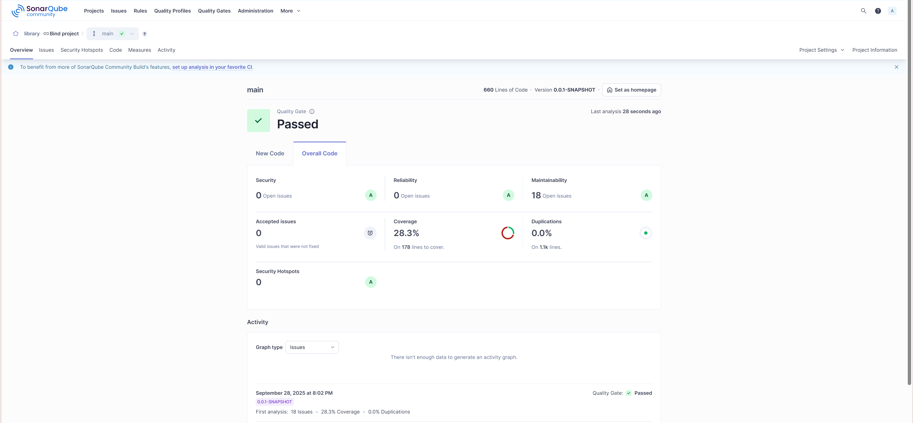

# TallerEvaluativo_2025-2 - Segundo Corte  

### 👤Integrantes:
- Elizabeth Correa
- Sebastian Ortega
- Belén Quintero
- Nikolas Martinez
- Juan Pablo Contreras 

## 📂 Nombre del repositorio  
Taller_Evaluativo_Corte_2_ROMANOS

---

## 🎯 Objetivo del Taller  
El objetivo de este taller es implementar un **Gestor de Tareas Colaborativo** simplificado, aplicando buenas prácticas de desarrollo de software como **Gitflow**, **principios SOLID**, **patrones de diseño** y una **arquitectura en capas**.  
El sistema permitirá la creación, gestión y filtrado de tareas, persistiendo la información en **MongoDB**.  

---

## 📌 Requerimientos del cliente  
- Crear un gestor de tareas colaborativo (similar a Trello, pero simplificado).  
- Permitir registrar, consultar y filtrar tareas según estado.  
- Garantizar la persistencia de los datos en una base de datos MongoDB.  
- Implementar filtrados eficientes con **Streams en Java**.  

---

## 📌 Requerimientos funcionales  
1. Crear tareas con **título, descripción, fecha y estado** (`PENDIENTE`, `EN_PROGRESO`, `COMPLETADA`).  
2. Listar todas las tareas existentes en el sistema.  
3. Filtrar tareas **COMPLETADAS** utilizando **Java Streams**.  
4. Persistir los datos en **MongoDB** para asegurar su almacenamiento.  

---

## ⚙️ Pre-requisitos técnicos  
- **Java OpenJDK** 17.x.x  
- **Apache Maven** 3.9.x  
- **JUnit** 5.x.x  
- **Git** y cuenta de **GitHub**  
- **Docker**  
- **Jacoco**  
- **SonarQube**  

---

## 🏗️ Arquitectura (MVC)

El backend sigue la **arquitectura Modelo–Vista–Controlador (MVC)**. La estructura de carpetas se organizó para mantener separación de responsabilidades y buenas prácticas de ingeniería:


```
📁 src/main/java/edu/dosw/taller/
│
├── 📁 configs/               # ⚙️ Configuraciones globales (Swagger, seguridad, etc.)
├── 📁 controller/            # 🌐 Controladores REST (exposición de endpoints)
├── 📁 model/                 # 📊 Módulo de modelos y lógica base
│   ├── 📁 components/        # 🧩 Componentes adicionales (clases auxiliares)
│   ├── 📁 entities/          # 📝 Entidades de dominio (Task, User, etc.)
│   ├── 📁 persistence/       # 🗄️ Persistencia y acceso a datos
│   │   └── 📁 repository/    # 🔗 Interfaces con la BD (MongoDB Repositories)
│   └── 📁 services/          # 🔧 Servicios dentro de la capa de modelo


``` 

### 📋 Descripción de capas:

| **Capa**         | **Responsabilidad**                                        | **Tecnologías / Anotaciones** |
|------------------|------------------------------------------------------------|--------------------------------|
| **Controller**   | Manejo de peticiones HTTP y exposición de endpoints REST.  | Spring MVC, `@RestController` |
| **Model**        | Contiene el modelo de dominio y submódulos relacionados.   | Java classes, Lombok, DTOs |
| ├─ **Entities**  | Definición de entidades principales (Task, User, etc.).    | `@Document`, `@Entity` |
| ├─ **Components**| Clases auxiliares/componentes dentro del dominio.          | Beans, helpers de dominio |
| ├─ **Persistence/Repository** | Interfaces de acceso a datos y consultas CRUD. | MongoDB, Spring Data |
| └─ **Services**  | Servicios asociados al modelo (lógica de negocio puntual). | `@Service` |
| **Configs**      | Configuración global de la aplicación.                     | Swagger, Security, CORS |

---

## 📊 Diagramas del sistema

Para la documentación y análisis del proyecto se generaron los siguientes diagramas UML:

- ### **Diagrama de Componentes Especifico**  
  

- ### **Diagrama de Clases**  
  

---

## 😎 Swagger
### **Link del swagger**: http://localhost:8080/swagger-ui/index.html

---

### 🟡 POST: 

Entrada:

 

Salida:

 

---

### 🟠 GET /tasks/search:

Entrada:



Salida:



---

### 🔴 DELETE

Entrada:



Proceso:



Salida:



---

## 🧩 Solución que sigue los principios SOLID

En la implementación del **Gestor de Tareas Colaborativo**, se aplicaron los principios **SOLID** de la siguiente manera:

### 1️⃣ S
Cada clase cumple una única responsabilidad:
- **TaskController** se encarga únicamente de las peticiones HTTP.
- Los **DTOs** encapsulan los datos de entrada y salida sin lógica adicional.
- **TaskRepository** se encarga únicamente de las consultas para poder acceder a **MongoDB**.
- Las clases encargadas del filtrado (FilterDateStrategy, FilterStatusStrategy, FilterKeyWordStrategy) implementan la lógica de negocio correspondiente.

### 2️⃣ O
El sistema está abierto a la extensión, pero cerrado a la modificación:
- Las clases de filtrado (FilterDateStrategy, FilterStatusStrategy, FilterKeyWordStrategy) implementan la interfaz **FilterStrategy**. Para añadir un nuevo filtro, simplemente se crear una nueva clase que implemente la interfaz. Así no toca modificar las clases que ya existe :)
- Con el patrón **Factory** (TaskFactory, BasicTaskFactory) se pueden crear diferentes tipos de tareas sin modificar la lógica que ya existe.

### 3️⃣ L
- **BasicTask** y **Task** cumplen este principio, ya que, cualquier lugar que requiera un **Task** puede funcionar correctamente con una instancia de **BasicTask**.
- Las implementaciones de **FilterStrategy** se pueden intercambiar, lo que garantiza el correcto funcionamiento de los filtros sin afectar al cliente que las usa.

### 4️⃣ I
- La interfaz **FilterStrategy** es simple y específica, ya que, solo obliga a implementar el método necesario para realizar el filtrado, sin métodos innecesarios de más.

### 5️⃣ D
- El controlador y los servicios dependen únicamente de **abstracciones** en lugar de implementaciones concretas.
- **TaskController** delega la lógica a los servicios, y estos dependen de la interfaz **FilterStrategy**. Esto ayuda a desacoplar el sistema y a permitir la extensibilidad del mismo.

---

## 🥥 JaCOCO



---

## 🐋 SonarQube




